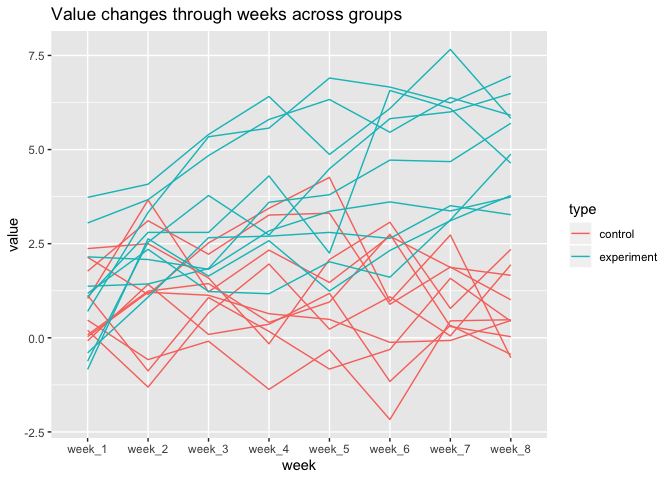

p8105\_hw5\_qz2392
================
Qimin Zhang
11/2/2019

# Problem 1

``` r
library(tidyverse)

set.seed(10)

iris_with_missing = iris %>% 
  map_df(~replace(.x, sample(1:150, 20), NA)) %>%
  mutate(Species = as.character(Species)) %>% 
  janitor::clean_names()
```

Write funtion to fill in the missing values.

``` r
fill_missing = function(x){
  if (is.numeric(x)){
    x = ifelse(is.na(x), mean(x, na.rm = T), x)
  }
  if (is.character(x)){
    x = ifelse(is.na(x), "virginica", x)
  }
  return(x)
}

iris_with_missing = 
  iris_with_missing %>% 
  map_df(~ fill_missing(.x))
```

# Problem 2

``` r
data = tibble(
  file_name = list.files(".", pattern = "*.csv")
)

data$data =
list.files(".", pattern = "*.csv") %>% 
  map(read_csv)
```

``` r
data =
  data %>% 
  unnest() %>% 
  mutate(
    type = case_when(
      file_name %>% str_detect("con") ~ "control",
      file_name %>% str_detect("exp") ~ "experiment",
    ),
    id = file_name %>% str_extract_all("[0-9]+") %>% as.numeric()
  ) %>% 
  select(type, id, everything(), -file_name)
```

``` r
data %>%
  pivot_longer(
    week_1:week_8,
    names_to = "week"
  ) %>% 
  mutate(
    type_id = paste(type, "_", as.character(id), sep = "")
  ) %>% 
  ggplot(aes(x = week, y = value, group = type_id, color = type)) +
  geom_line()
```

<!-- -->

The values of experiment group are generally higher than that of control
group.

# Problem 3
